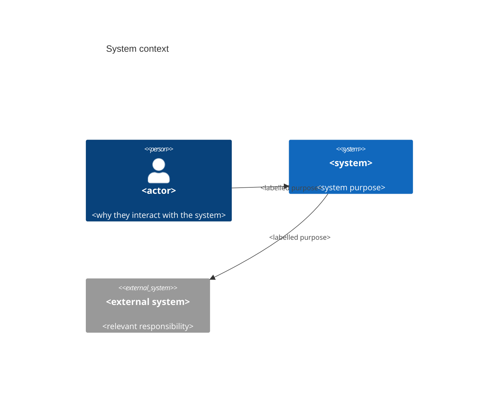
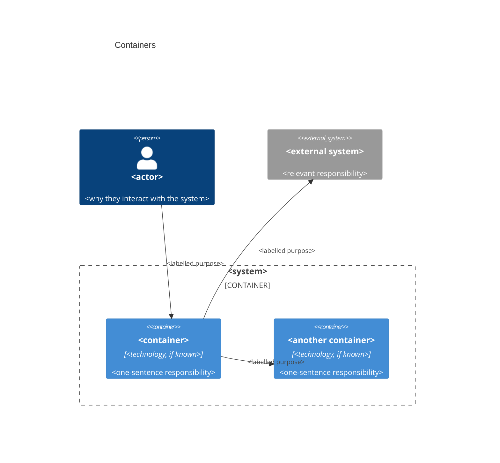
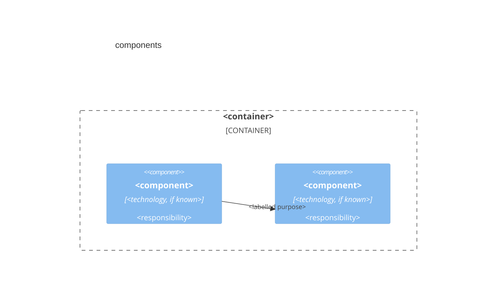
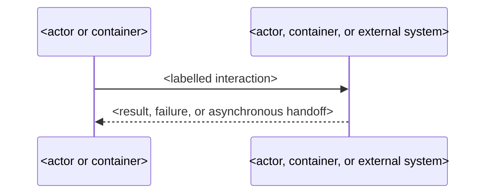

# Initial architecture discovery

Use this skill when a person has an early product idea and needs a shared,
high-level account of the people, systems, containers, and relationships before
implementation planning starts.

This is initial architecture discovery, not a grilling session. Work from the
idea and only project material the person explicitly supplies or has already
opened. Do not research speculative systems or fill gaps with invented detail.

## Discovery

1. Restate the idea in a sentence and name the known actors, external systems,
   and system under discussion. Mark missing facts as unknown.
2. Ask compact rounds of high-level questions. Ask only when the answer could:
   - add, remove, or rename an actor, external system, or container;
   - change a container's one-sentence responsibility;
   - change an important labelled relationship; or
   - determine whether an optional diagram is needed.
3. Do not ask about code, detailed data models, APIs, screens, delivery work,
   or implementation choices. Record material unanswered questions instead of
   trying to resolve them.
4. Stop when the context and container diagrams can be drawn without inventing
   facts, every material relationship among included actors, systems, and
   containers is shown in its appropriate view with a purpose label, every
   container has one responsibility sentence, and remaining questions that
   could change the diagrams are recorded.

If the supplied material cannot establish those facts, say what is unknown and
ask the smallest useful next round. Do not keep questioning once the stop rule
is met.

## Record

Return one self-contained Markdown record in the response. Use the following
outline, replacing placeholders with known facts and omitting only optional
diagram sections that are not warranted.

~~~~markdown
# Initial architecture: <product or system>

## Current understanding

<One short paragraph describing the system's purpose and scope.>

## System context

## Containers

## Components

## Sequence

## Material unresolved questions

- <A question whose answer could change an included view.>
~~~~

The context and container diagrams are mandatory. Use Mermaid C4 syntax and
show every material relationship in the view with a label in both. Include each
actor or external system that matters to the view. Keep each diagram at a level
appropriate for initial planning.

Add a component diagram only when supplied material identifies independently
meaningful responsibilities, adapters, or decision policies inside one
container, and leaving their interaction out would hide a material architecture
decision. Never infer components from directories, classes, or speculative
implementation.

Add a sequence diagram only when ordering, state changes, failure handling, or
asynchronous work would otherwise be unclear. Do not add one just to show a
normal request and response.

Do not add code-level diagrams, full file or class inventories, detailed data
models, API designs, screen designs, implementation issue drafts, or unrelated
requirements. Do not create GitHub issues, update `AGENTS.md`, choose where to
store the record, save it, or publish it. A viewer may render the returned
Markdown and Mermaid source only when explicitly requested; this skill never
publishes artifacts automatically.
